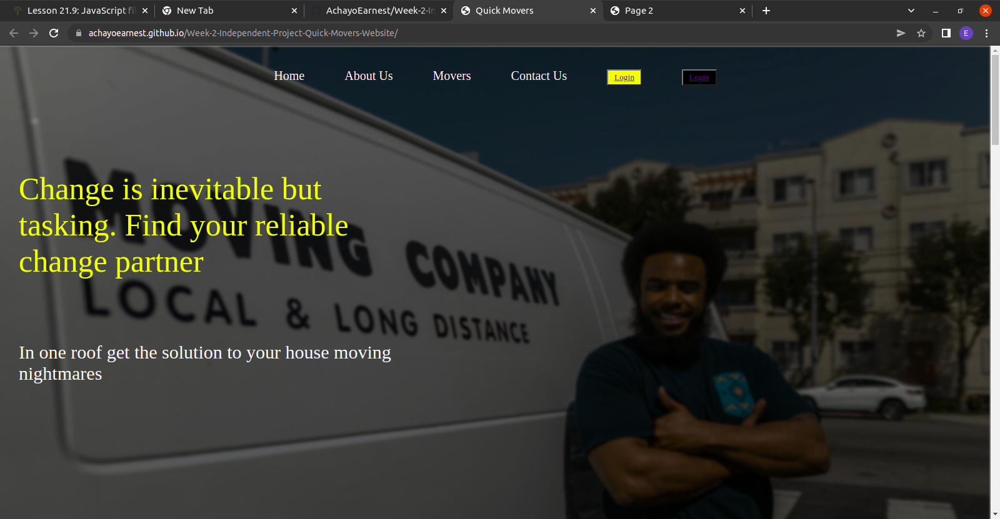

# Quick Movers Website (Page 1 & Page 2)

## By Earnest Achayo

 
 

## Table of Content

- [Description](#description)
- [Features](#features)
- [Behaviour Driven Development](#Behaviour-Driven-Development)
- [Requirements](#requirements)
- [Installation Process](#installation-Process)
- [Live Link](#Live-Link)
- [Technology Used](#technology-Used)
- [Licence](#licence)
- [Authors Info](#Authors-Info)

## Description

 This project is a web application having the first page (index.html) with a landing page of a Top Movers website where clients can see the services being offered by the service providers. Viewers  can view from the nav bar componets to see more information about the services offered, contact information and ability to sign up and login to the website as a member. 

The second page contains a real estate site focusing on modern house selling. This page has user's enquiry collection form to be filled by any interested customer. The page contains wonderful images of different furnished houses for the customers to choose from. It also has a well detailed description about the available spaces and the features of the rooms. 

## Features
Page 1 (Quick Movers Website)
As a user:
1. Youll be able to access signup and login buttons to be a member of this site 
2. You will be able to access the Service provider contacts and ask any question and get instant feedback as soon as possible
3. You will be able to view images about the available options to move your house/home stuff efficiently from one point to your prefered destination.
4. You will be able to enroll through links to other pages Quick Movers website.

Page 2 (Real Estate House sales)
As a user:
1. Youll be able to select from available /furnished houses and submit your details to the owners
2. You will be able to access the Service provider facebook, twitter, & instagram handles and ask any question and get instant feedback as soon as possible
3. You will be able to view images about the available houses and furnished rooms.
4. You will be able to enroll and work with the website owners team.

## Behavioral Driven Development
| Behavior | Input | Output |
| Click the available links | Outputs by connecting the user to other pages |
			    | You can read more info about the school and see pictorial presentations as well from the landing page|

### Requirements
* Access to a computer or any other gadget.
* Access to internet I.e through bundles.

*********************************************************************************************************************************
* Clone to the developer repo: git clone  https://github.com/AchayoEarnest/Week-2-Independent-Project-Quick-Movers-Website.git  *
* Unzip the downloaded files in a folder of choice.                                                                             *
* pen the index file from the zipped file with any browser.                                                                     *
*********************************************************************************************************************************
### Live Link
    • Click this link to view the live application

### Technology used: 
    1) Hyper Text Markup Language (HTML) – Was used to develop the structure of the page
    2) Cascading Style Sheets (CSS) -Was used to develop the styling of the page
    3) README.md for the md document to help other developers and users undestand more on how to use the page

### Known bugs
- No known bugs so far

##### Licence

(c) [2022] [Earnest Achayo]
Permission is hereby granted, free of charge to any person obtaining a copy of this software and associated documentation files (the "Software"), to dealing with the Software without restriction, including without limitation the rights of use, copy, modify, merge, publish, distribute, sub license, and/or sell copies of the Software, and to permit persons to whom the Software is furnished to do so, subject to the following conditions:The above copyright notice and this permission notice shall be included in all copies or substantial portions of the Software.

THE SOFTWARE IS PROVIDED "AS IS", WITHOUT WARRANTY OF ANY KIND, EXPRESS ORIMPLIED, INCLUDING BUT NOT LIMITED TO THE WARRANTIES OF MERCHANTABILITY,FITNESS FOR A PARTICULAR PURPOSE AND NON-INFRINGEMENT. IN NO EVENT SHALL THEAUTHORS OR COPYRIGHT HOLDERS BE LIABLE FOR ANY CLAIM, DAMAGES OR OTHERLIABILITY, WHETHER IN AN ACTION OF CONTRACT, TORT OR OTHERWISE, ARISING FROM, OUT OF OR IN CONNECTION WITH THE SOFTWARE OR THE USE OR OTHER DEALINGS IN THE SOFTWARE.

## Authors Info

Slack Profile – [Earnest Achayo] https://app.slack.com/client/T0101L740P4/D03CZA836HZ 